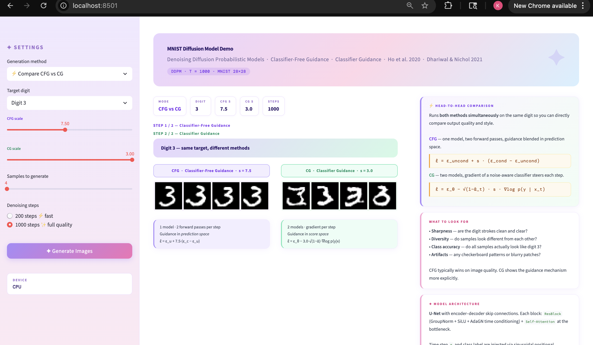

# Diffusion Model: CFG vs Classifier Guidance on MNIST

A PyTorch implementation of DDPM (Denoising Diffusion Probabilistic Models) on MNIST with two conditional generation strategies:

- **Classifier-Free Guidance (CFG)** — single model trained with 10% label dropout; guidance applied at inference by blending conditional and unconditional predictions
- **Classifier Guidance (CG)** — unconditional diffusion model steered at inference by gradients from a separately trained noise-aware classifier

---

## Demo



> **CFG vs CG side-by-side** — the Streamlit app lets you pick a digit, tune guidance scales for both methods, and generate samples in real time. Run it with:
>
> ```bash
> streamlit run app.py
> ```

---

## Project Structure

```
.
├── diffusion/
│   ├── forward.py          # Forward (noising) process
│   ├── scheduler_ddpm.py   # DDPM noise schedule (betas, alphas, posterior variance)
│   ├── training.py         # Shared training loop for CFG and CG modes
│   └── sampling.py         # sample_cfg() and sample_cg() inference functions
├── models/
│   ├── unet.py             # U-Net with time + class embeddings
│   ├── classifier.py       # Noise-aware classifier for CG
│   ├── fid_extractor.py    # Feature extractor for FID computation
│   └── mlp.py              # Utility MLP block
├── train/
│   ├── train.py            # Train CFG diffusion model
│   ├── train_cg.py         # Train unconditional model for CG
│   ├── train_classifier.py # Train noise-aware classifier
│   └── train_fid_extractor.py
├── sample/
│   └── sample.py           # Generate images (all three modes)
├── evaluation/
│   └── evaluate.py         # FID, Inception Score, class accuracy, comparison grids
├── checkpoints/            # CFG model weights
├── checkpoints_cg/         # CG (unconditional) model weights
└── requirements.txt
```

---

## Setup

```bash
pip install -r requirements.txt
```

Requires CUDA. CPU fallback is supported but training will be slow.

---

## Training

### 1. CFG Diffusion Model

```bash
python train/train.py --epochs 20 --batch-size 64 --checkpoint-dir checkpoints
```

Trains the U-Net with 10% label dropout so it learns both conditional and unconditional denoising in a single model. Saves checkpoints to `checkpoints/`.

| Argument | Default | Description |
|---|---|---|
| `--epochs` | 20 | Number of training epochs |
| `--batch-size` | 64 | Batch size |
| `--learning-rate` | 1e-4 | Adam learning rate |
| `--model-channels` | 64 | Base channel width of the U-Net |
| `--checkpoint-dir` | `checkpoints` | Where to save weights |

### 2. Unconditional Model for CG

```bash
python train/train_cg.py --checkpoint-dir checkpoints_cg
```

Trains the same U-Net architecture but always uses the null token (label=10), producing a purely unconditional model suitable for classifier guidance.

### 3. Noise-Aware Classifier (required for CG sampling)

```bash
python train/train_classifier.py
```

Trains a classifier that takes noisy images and a timestep as input, enabling gradient-based steering during the CG reverse process.

---

## Sampling

```bash
# Unconditional generation
python sample/sample.py --guidance-type unconditional

# Classifier-free guidance (default, scale=7.5)
python sample/sample.py --guidance-type classifier-free --guidance-scale 7.5

# Classifier-guided sampling
python sample/sample.py --guidance-type classifier-guided \
    --cg-model-path checkpoints_cg/model_final.pth \
    --classifier-path checkpoints/classifier_final.pth \
    --guidance-scale 0.5
```

Results are saved to `results/` as PNG grids. The script also sweeps across guidance scales for digit 3 to visualise the trade-off between diversity and fidelity.

---

## Evaluation

```bash
# Evaluate CFG
python evaluation/evaluate.py --guidance-type classifier-free

# Evaluate CG
python evaluation/evaluate.py --guidance-type classifier-guided

# Evaluate both side-by-side
python evaluation/evaluate.py --guidance-type both
```

Computes:
- **FID Score** — pixel-based (lower is better, target < 50)
- **Inception Score** — using MNIST classifier (higher is better, target > 7.5)
- **Class Accuracy** — % of generated samples correctly classified
- Comparison grid: Real vs CFG vs CG

---

## How It Works

### DDPM Forward Process

Gaussian noise is incrementally added over T=1000 timesteps using a linear beta schedule. The model is trained to predict the added noise at any timestep.

### Classifier-Free Guidance (CFG)

At inference, the U-Net is run twice per step — once with the target class label and once with the null token — and the outputs are blended:

```
ε̂ = ε_uncond + s × (ε_cond − ε_uncond)
```

where `s` is `--guidance-scale`. Higher values increase class fidelity at the cost of diversity. Recommended: `s = 7.5` for MNIST.

### Classifier Guidance (CG)

At inference, the unconditional U-Net predicts noise, then the classifier gradient steers the update:

```
ε̂ = ε_θ − √(1 − ᾱ_t) × s × ∇log p(y | x_t)
```

This follows [Dhariwal & Nichol 2021](https://arxiv.org/abs/2105.05233). Recommended scale: `s = 0.5`.

---

## Results

Training loss curves are saved after each training run:
- `training_loss_cfg.png` — CFG model
- `training_loss_cg.png` — unconditional model

Evaluation outputs are saved under `evaluation/`:
- `comparison_grid.png` — Real vs CFG vs CG side-by-side
- `cfg_per_class.png` / `cg_per_class.png` — per-class sample grids
- `diffusion_process.png` — forward noising visualisation

---

## Requirements

- Python 3.8+
- PyTorch 2.x with CUDA
- torchvision, numpy, scipy, tqdm, matplotlib
